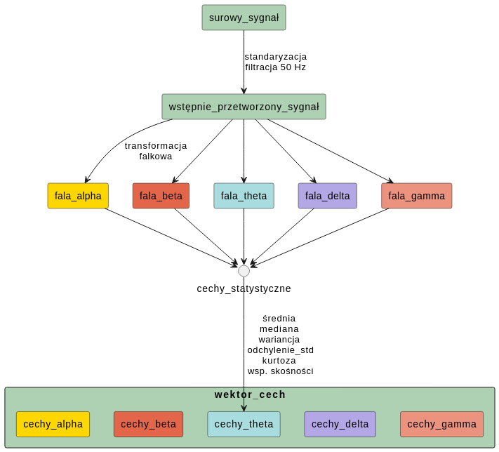

# ADHD EEG Classifier

## Project setup

Create a Virtual Environment

```bash
python3 -m venv .venv
```

Activate venv

```bash
source .venv/bin/activate # for Linux
# or 
.venv\Scripts\activate # for Windows
```

Install libraries

```bash
pip install -r requirements.txt
```

## How to start

Currently, 'model_training.py' is the main project script that should be run to perform model training. The program should be run in the terminal using command-line arguments. To see the available options and example runs, execute:

```bash
python3 model_training.py -h # or --help
```

The project also includes a script for data visualization. 'visualizer.py' generates plots of the signals from the database. To check the available options, execute:
```bash
python3 visualizer.py -h # or --help
```

## Feature extraction:
Due to Master Thesis limitation some of the documentation could be written in Polish.
